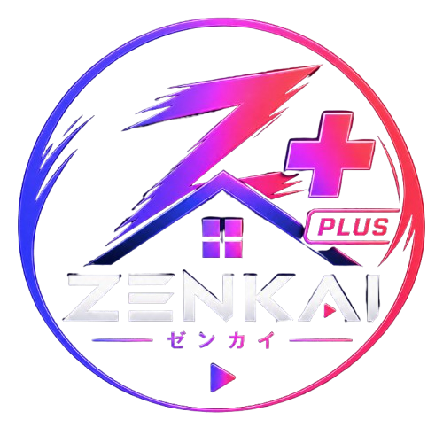

<div align="center">
  
  <h1>Zenkai Theme Pro</h1>
  <p><b>A premium neon developer environment for Visual Studio Code.</b></p>

  <p>
    
    
    
  </p>
</div>

---

## About Zenkai Pro ^_^

[**Zenkai Theme Pro**](https://github.com/ViselBrx/Zenkai-VSCode-Extension) is the premium edition of the Zenkai visual ecosystem. It brings the neon atmosphere of the Zenkai universe into the entire Visual Studio Code workbench: from the first folder in Explorer to the last symbol in IntelliSense.

The Pro experience combines deep dark color themes, high-contrast neon accents, hand-built SVG file icons and a dedicated developer product icon theme. The result is an editor that feels consistent while remaining practical for real projects.

### What makes it Pro?

- **Premium color themes** designed for long coding sessions.
- **Hundreds of recognizable SVG file and folder icons**, generated as a coherent visual system.
- **Developer product icons** for Explorer, Source Control, Run, Debug, Testing, Terminal, Settings and more.
- **Enhanced IntelliSense symbols** for functions, classes, methods, variables, interfaces, enums, modules and parameters.
- **Supabase, Docker, Kubernetes, Terraform and Vercel** icons for modern application stacks.
- **License-controlled access** with local development preview support.

## File Icons Preview

The Pro file icon system is built around a neon frame, a deep-black center and a recognizable symbol inside. The artwork stays readable at Explorer size, whether the file is a familiar language or a specialized infrastructure configuration.

### Languages and runtimes

When a project mixes multiple languages, the icons make the tree scannable at a glance. A JavaScript file gets its own mark , while TypeScript , Python , Go  and Rust  remain visually distinct even in a dense workspace.

<div align="center">
  
  
  
  
  
  
  
  
</div>

### Frameworks and frontend

React , Vue , Svelte  and Angular  each have their own visual identity. Mobile and cross-platform projects also get dedicated Flutter , Dart , Kotlin  and Swift  artwork.

<div align="center">
  
  
  
  
  
  
  
  
</div>

### Cloud, data and infrastructure

Modern stacks should look modern in the Explorer too. Supabase , Docker , Kubernetes , Terraform  and Vercel  are represented by custom neon drawings instead of generic text badges. Firebase, GraphQL and Prisma complete the data and deployment set.

<div align="center">
  
  
  
  
  
  
  
  
</div>

### Folder intelligence

Folders are part of the architecture, not empty space. Source , application , components , API , database  and test  directories all receive contextual icons. Infrastructure folders such as Kubernetes and Terraform are covered as well.

<div align="center">
  
  
  
  
  
  
  
  
</div>

## Developer Workbench

The Pro product icon theme extends the same visual language beyond files. It covers the Activity Bar, Explorer, Search, Source Control, Run and Debug, Testing, Terminal, Settings and editor labels.

The IntelliSense experience is included too: symbols such as  functions, classes, methods, variables, interfaces, enums, modules and namespaces receive dedicated product icon mappings. The goal is simple: every step from writing code to testing and debugging feels like part of the same editor.

### Product Icons Repack Preview

<div align="center">
  <!-- Replace this placeholder with assets/product-icons-repack.png when the screenshot is ready. -->
  <p><i>Product Icons repack screenshot coming soon.</i></p>
</div>

### File Icons Repack Preview

<div align="center">
  <!-- Replace this placeholder with assets/file-icons-repack.png when the screenshot is ready. -->
  <p><i>File Icons repack screenshot coming soon.</i></p>
</div>

## The Themes

Zenkai Pro currently includes two exclusive color themes:

- **Zenkai Stellar Abyss** — a deep blue-violet atmosphere with a cinematic developer focus.
- **Zenkai Christmas** — a seasonal neon variation with festive accents.

The free extension contains the standard Zenkai Neon collection, including Cyan, Green, Yellow, Red, Purple, Orange, Blue, Dark Green, White and Aqua.

## Installation

The Pro extension depends on the free [Zenkai Theme](https://marketplace.visualstudio.com/items?itemName=zenkai.zenkai-vscode-extension) extension.

### From a VSIX

1. Install the free Zenkai Theme extension from the [VS Code Marketplace](https://marketplace.visualstudio.com/items?itemName=zenkai.zenkai-vscode-extension) or [Open VSX Registry](https://open-vsx.org/extension/zenkai/zenkai-vscode-extension).
2. Download the Pro `.vsix` package.
3. Open **Extensions** in VS Code, select `...` and choose **Install from VSIX...**.
4. Reload the window when prompted.

### Build and test locally

From the Pro project directory:

```powershell
npm install
npm run generate:file-icons
npm run generate:product-icons
npm run compile
npx @vscode/vsce package --allow-missing-repository
```

Install the generated package with:

```powershell
code --install-extension .\zenkai-vscode-extension-pro-0.0.1.vsix --force
```

During `F5` development runs, the extension enables a visual preview of Pro assets without requiring a production license. Packaged installations use the Dodo Payments license flow.

## Activation

Open the Command Palette (`Ctrl+Shift+P` or `Cmd+Shift+P`) and use:

- `Zenkai Pro: Activate License`
- `Zenkai Pro: Check License`
- `Zenkai Pro: Deactivate License`

After activation, Pro applies the color theme, file icon theme and product icon theme automatically.

## Official Links

- [**Zenkai Theme — VS Code Marketplace**](https://marketplace.visualstudio.com/items?itemName=zenkai.zenkai-vscode-extension)
- [**Zenkai Theme — Open VSX Registry**](https://open-vsx.org/extension/zenkai/zenkai-vscode-extension)
- [**Zenkai GitHub Repository**](https://github.com/ViselBrx/Zenkai-VSCode-Extension)
- [**Zenkai Website**](https://zenkai-streaming.vercel.app/index.html)

## Explore the Zenkai Universe

The Zenkai ecosystem brings together **Anime, Cartoons, Movies, Manga, Comics, Games and ZenkAI** in one immersive universe.

- [**Anime**](https://zenkai-streaming.vercel.app/animes) — action, fantasy and classics.
- [**Cartoons**](https://zenkai-streaming.vercel.app/desenhos) — nostalgic Warner, Cartoon Network and Disney titles.
- [**Movies**](https://zenkai-streaming.vercel.app/filmes) — cinema sessions for every mood.
- [**ZenkAI**](https://zenkai-streaming.vercel.app/zenkai) — the Zenkai AI experience.
- [**Manga & Comics**](https://zenkai-streaming.vercel.app/mangas) — organized chapters and comic sagas.
- [**Store & Games**](https://zenkai-streaming.vercel.app/loja) — quests, rewards and customization.

## Credits and License

The Pro package is distributed according to [LICENSE](LICENSE). Third-party font and product icon notices are available in [product-icons/THIRD-PARTY-NOTICES.md](product-icons/THIRD-PARTY-NOTICES.md).

<div align="center">
  <p>Made by the <b>Zenkai Team &lt;3</b></p>
  <p>© 2026 Zenkai · Animes, Movies, Cartoons, Manga, Comics and Artificial Intelligence</p>
  <p><b>⚡ Your editor. Your universe. Pro mode.</b></p>
</div>

## Enjoy! ♡
